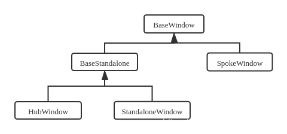
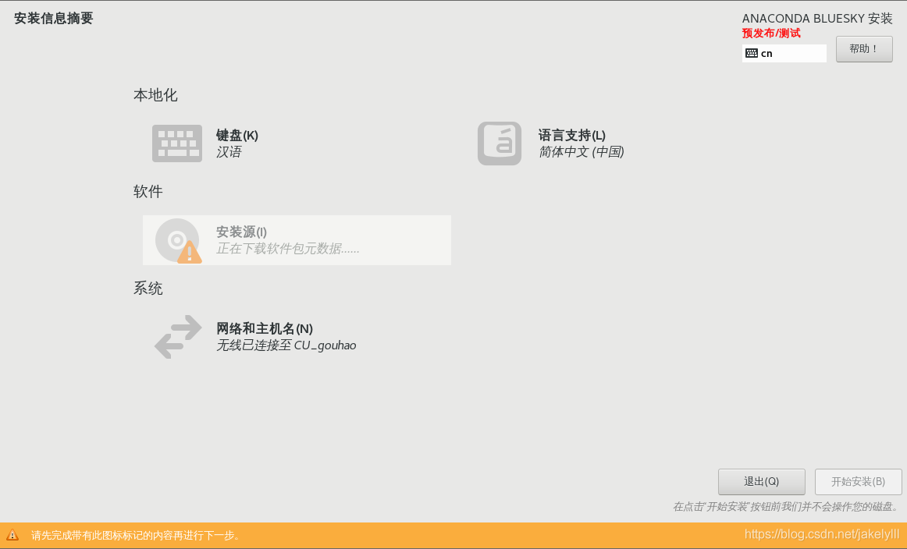
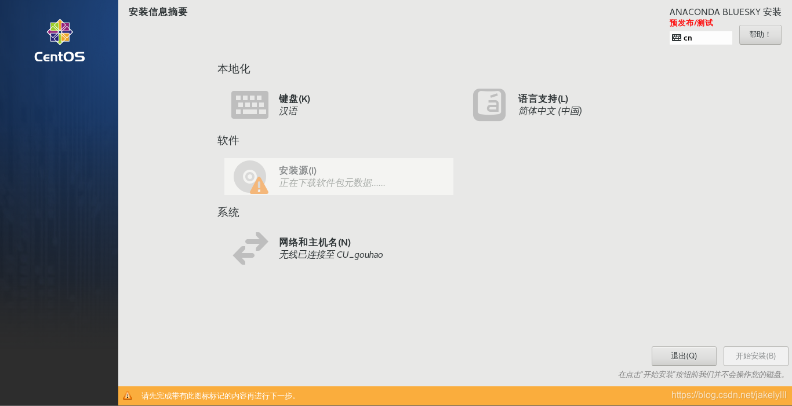
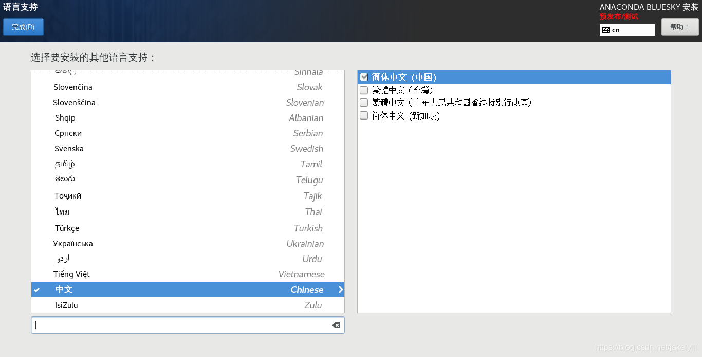

## 简介
本文主要介绍CentOS安装程序Anaconda界面结构及运行流程。

本次主要介绍界面结构。Anaconda界面使用Gtk+，语言使用python和c。c代码主要实现了基础框架和一些组件，python代码实现了具体各个页面的业务逻辑。界面上的ui样式使用css去定制。

## 基础组件
基础组件代码位于widgets/src中，样式文件位于resources中。基础组件分为两类：窗口和控件。




上面是窗口的类图。
BaseWindow：定义了窗口主体的布局框架。
BaseStandalone：定义了一个独立窗口的基本布局，就是每个一级窗口
SpokeWindow：对话窗口，用户可以在这些窗口选择配置，像选择键盘布局，选择磁盘那些窗口
StandaloneWindow：一个独立窗口的实现类，只有第一个界面选择语言那个窗口是这种类型
HubWindow：也是一个独立窗口。在这些窗口中集成了SpokeWindow的入口按钮

先看一下BaseWindow窗口的组成部分。如下图：


一个BaseWindow分为3个部分：

顶部是导航栏nav_area(从安装信息摘要到右侧帮助按钮那一行)，主要显示窗口名称，发行版名称，键盘布局和帮助按钮等，图中预发布／测试标签在正式版没有，我是直接从shell运行的所以会有这个；

中间是内容区域action_area(从本地化，直到退出按钮下面的文字)，主要提供用户操作选择内容；（注：内容区域是各个业务自己添加，本图中没做处理，像本地化、软件、系统，还有退出和开始安装那两个按钮不属于BaseWindow的，下图也一样）

最后是信息区info_bar（黄色的那个条）：这里显示警告，错误，信息等提示；

下图是BaseStandalone窗口：


BaseStandalone窗口，只是在左边加了个sidebar，主要显示CENTOS图标和名称； 

窗口的布局本来是从左上角(0,0)点开始的，BaseStandalone把父窗口BaseWindow的布局向右移了一定的距离用来绘制sidebar,添加sidebar的逻辑由BaseStandalone.c中anaconda_base_standalone_size_allocate， anaconda_base_standalone_on_draw这两个函数完成。

```c
static void anaconda_base_standalone_size_allocate(GtkWidget *window, GtkAllocation *allocation) {
    GtkAllocation child_allocation;
    GtkWidget *child;
    int sidebar_width;

    GTK_WIDGET_CLASS(anaconda_base_standalone_parent_class)->size_allocate(window, allocation);

    /*
     * For RTL languages, the width is reduced by the same amount, but the
     * start of the window does not need to move.
     */
    gtk_widget_set_allocation(window, allocation);
    sidebar_width = get_sidebar_width(window);
    child_allocation.y = allocation->y;
    child_allocation.width = allocation->width-sidebar_width;
    child_allocation.height = allocation->height;

    if (gtk_get_locale_direction() == GTK_TEXT_DIR_LTR)
        child_allocation.x = allocation->x+sidebar_width;
    else
        child_allocation.x = allocation->x;

    child = gtk_bin_get_child (GTK_BIN (window));
    if (child && gtk_widget_get_visible (child))
        gtk_widget_size_allocate (child, &child_allocation);
}
```
size_allocate是gtk的函数用来计算控件的大小。在BaseStandalone中先调用父类BaseWindow的size_allocate函数，BaseWindow没有重写size_allocate所以调用的是默认的计算函数。计算完父布局的宽高的，获取sidebar的宽度get_sidebar_width：
```c
static int get_sidebar_width(GtkWidget *window) {
    GtkAllocation allocation;

    gtk_widget_get_allocation(window, &allocation);

    //STANDALONE_SIDEBAR_WIDTH_PCT是0.15
    return allocation.width * STANDALONE_SIDEBAR_WIDTH_PCT; 
}
```
sidebar的宽度是父布局的0.15倍，然后把父布局的宽度减去sidebar的宽度就是最终BaseWindow的内容的宽。

最后根据语言的阅读习惯计算出绘制的x点，如果是语言是从左到右阅读，则BaseWindow的绘制起点就是allocate->x+sidebar_width（在真实安装的时候allocate->x是0，所以就是从sidebar_width）开始绘制，相当于给左侧留出了sidebar_width的宽用来绘制logo；如果语言是从右到左阅读的，那就直接从allocate->x的位置开始绘制，logo会绘制到右侧。

anaconda_base_standalone_on_draw函数比较简单，首先将父类BaseWindow的内容绘制完后，然后，再绘制sidebar区域。

StandaloneWindow在BaseStandalone的基础上增加了退出和确定按钮，目前只有第一个选择语言的界面是这种类型。

HubWindow在BaseStandalone的基础中在中间的action_area中增加了一个可滚动的控件，因为Hub中的内容有可能超过一屏显示。

SpokeWindow在BaseWindow的基础上，在左上角窗口名称的下面增加了一个确定按钮，如下：



widget中还有一些其他的控件：
DiskOverview.c：磁盘图标
LayoutIndicator.c：键盘布局的图标
MountpointSelector.c：挂载点选择
SpokeSelector.c：Spoke窗口的入口

窗口样式配置在同一目录的resourses目录中，可以在这些样式中改窗口的风格，这些资源文件都是用类和控件命名的，所以根据名字也能知道是哪个样式。

## 业务组件
业务代码是用python写的，在pyanaconda里。界面部分的代码在pyanaconda/ui/gui里。界面的样式代码在data/anaconda-gtk.css中。gui里主要有两种spokes和hubs。

每个spoke都属于一个类别，在每个spoke中有一个category字段，如：
```py
class UserSpoke(FirstbootSpokeMixIn, NormalSpoke, GUISpokePasswordCheckHandler):
    builderObjects = ["userCreationWindow"]

    mainWidgetName = "userCreationWindow"
    focusWidgetName = "t_fullname"
    uiFile = "spokes/user.glade"
    helpFile = "UserSpoke.xml"

    category = UserSettingsCategory

    icon = "avatar-default-symbolic"
    title = CN_("GUI|Spoke", "_USER CREATION")
```
category的分类在pyanaconda/ui/categories里。而每个category又属于一个hub，如：
```python
class SoftwareCategory(SpokeCategory):
    displayOnHubGUI = "SummaryHub"
    displayOnHubTUI = "SummaryHub"
    sortOrder = 200
    title = N_("SOFTWARE")
```
这样就将spoke和hubs联系起来了。

在spoke要目录里有个welcome.py比较特殊，它是安装程序的第一个页面，就是选语言的那个界面。
```python
class WelcomeLanguageSpoke(LangLocaleHandler, StandaloneSpoke):
    mainWidgetName = "welcomeWindow"
    focusWidgetName = "languageEntry"
    uiFile = "spokes/welcome.glade"
    helpFile = "WelcomeSpoke.xml"
    builderObjects = ["languageStore", "languageStoreFilter", "localeStore",
                      "welcomeWindow", "betaWarnDialog", "unsupportedHardwareDialog"]

    preForHub = SummaryHub
    priority = 0
```
在这类里有个`preForHub = SummaryHub`，意思就是要在SummaryHub这个hub之前运行。

hubs里就两个：summary.py和progress.py。summuary是选语言，软件的那个界面；progress是开始安装有进度条的那个界面。welcome要在summary之前运行，所以它就是第一个界面了。